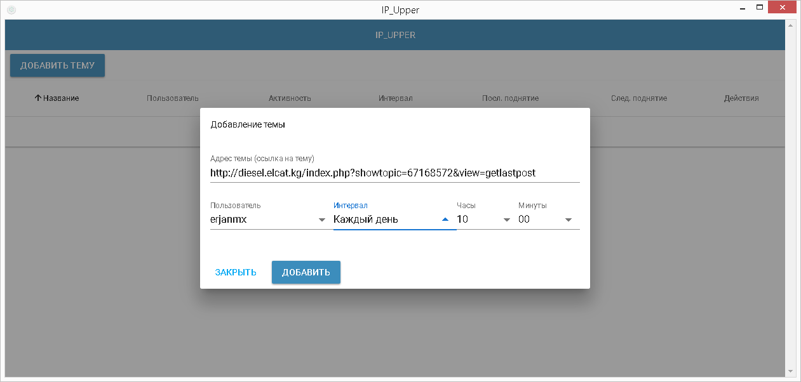
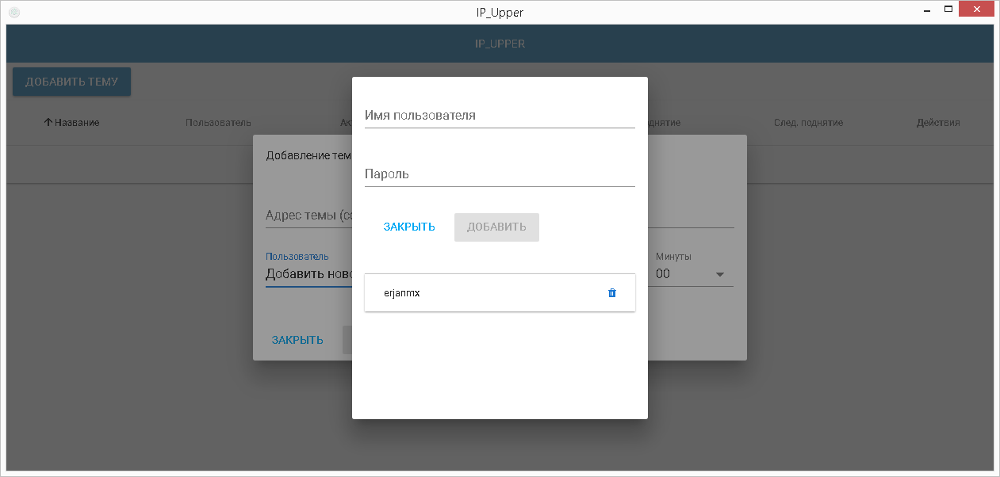
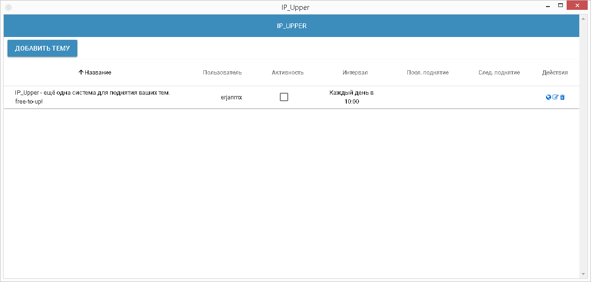

# IP_Upper-desktop

Приложение написано с использованием Electron, это означает что будет одинаково работать на Windows, MacOS и Linux.

На текущий момент готова бета-версия и мне бы очень не помешала бы помощь пользователей кто готов использовать и оперативно давать отзывы по выявлению и устранению ошибок и добавлении необходимых функций. 

Разработка ведется с возможностью дальнейшего коммерческого запуска поэтому для тех, кто будет участвовать в тестировании и давать отзывы по работе приложения будет возможность при запуске получить его бесплатно.

Есть возможность добавлять неограниченное количество тем и пользователей.

### Скриншоты

